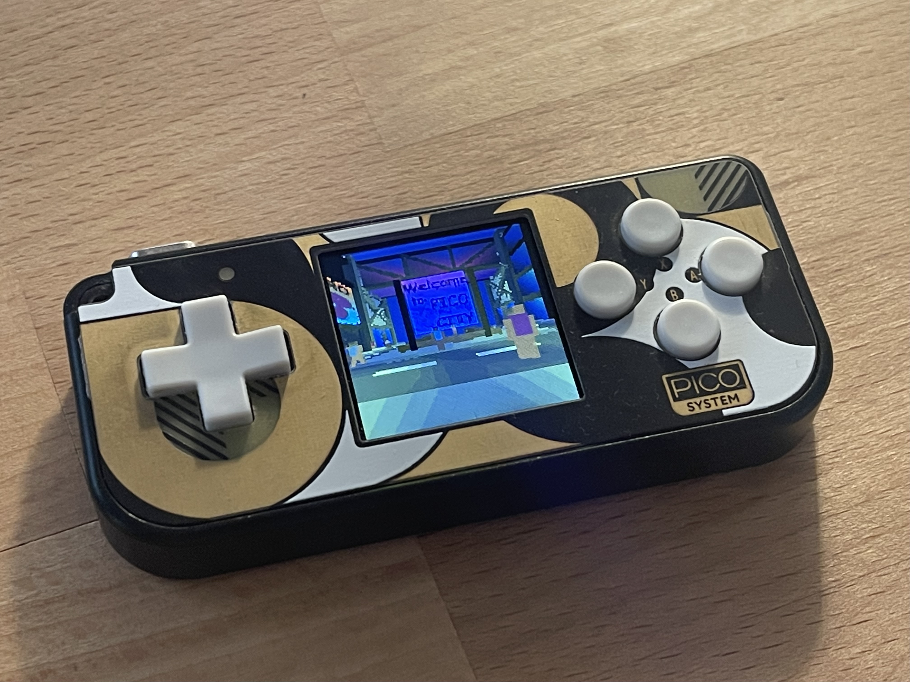

# Pico3D Engine for the PicoSystem

⚠️ Documentation on how to modify and use the engine is still being worked on, please be patient.

## Getting Started

You will need the [PicoSystem SDK](https://github.com/pimoroni/picosystem) (and the required Pico SDK).  
Copy the whole Pico3D folder as an example project into picosystem/examples and add "add_subdirectory(pico3d)" entry into the CMakeLists.txt.

The project needs multi-core support to compile:  
Add pico_multicore to the target_link_libraries in picosystem.cmake found in picosystem/libraries.

You should now be able to compile all the examples including pico3d.

## F.A.Q.

Why are there so many redundant functions in certain code areas like the zombie logic?  
Divisions are relatively expensive on the RP2040 if performed in quick succession such as when interpolating vertices for mesh blending. Performance can be tested by changing the NPC or Zombie walk animations to a non power of 2 number such as 127, forcing the compiler to apply actual divisions instead of much cheaper bit shifts. As the compiler does not know during compilation time if a variable will be a power of 2 or not, it will simply apply divisions regardless if the value is not fixed as it is now. There are likely ways to improve on this code redundancy but I have not taken the time to think of one yet (don't forget, function calls themselves are relatively expensive).
