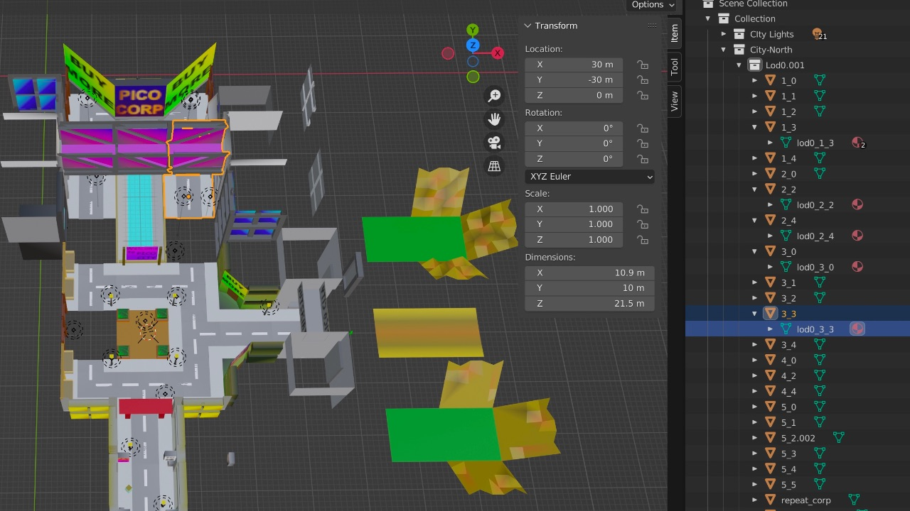
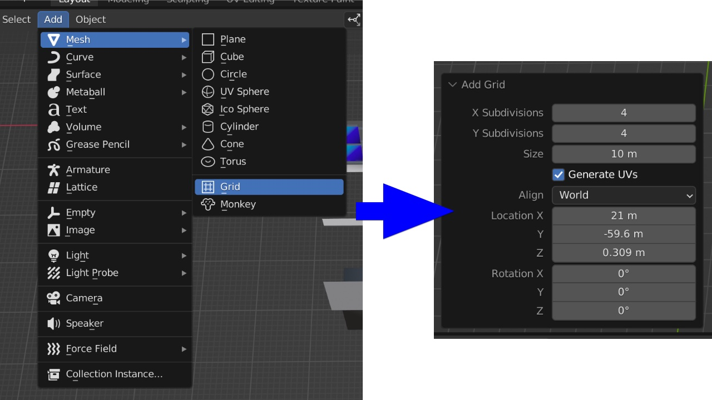
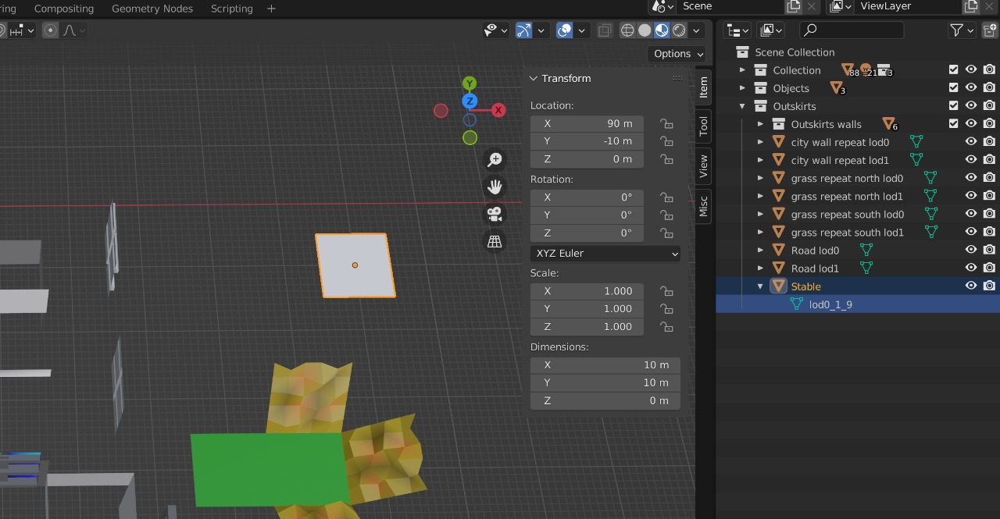
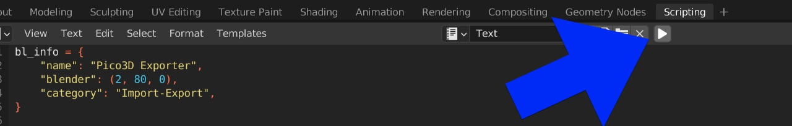
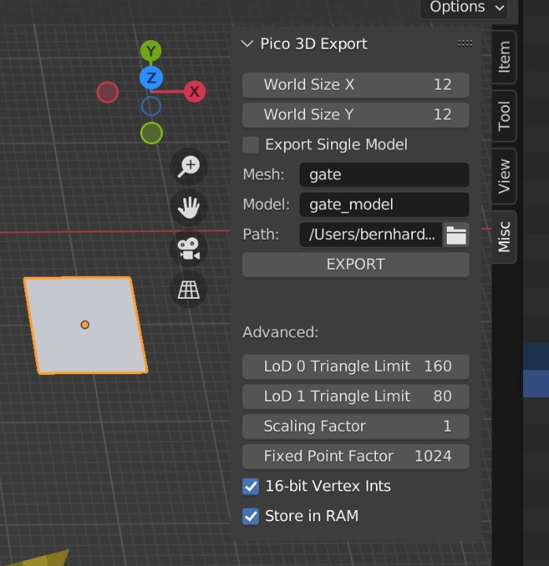
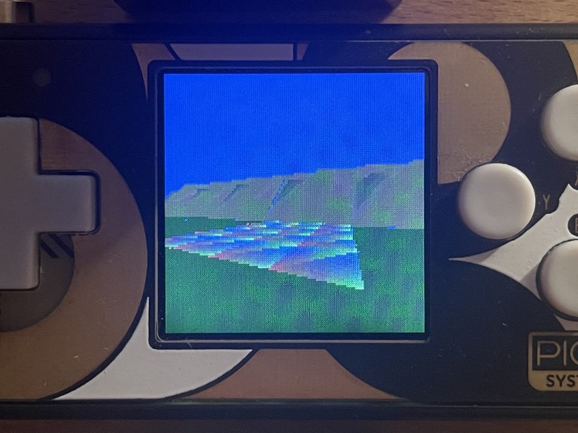
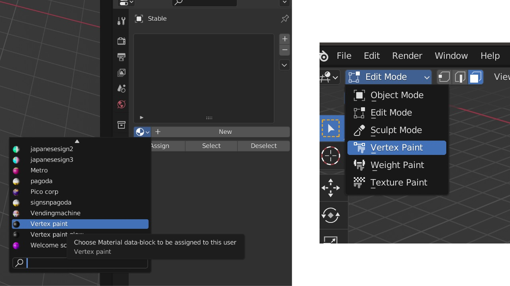
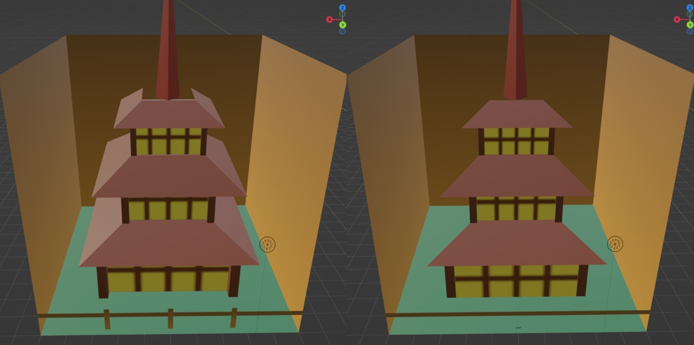

# Creating a game world in Blender

So you have decided to take the exciting step of creating your own custom Pico3D game! This tutorial will guide you through using the Blender exporter based on an example. Let's get started!

## The file that does it all
In the Blender folder you will find world.blend, which is able to export the complete world of Pico3D and the included prototype game (excluding the npc meshes for the moment). Upon opening it in Blender, you might be overwhelmed by the large number of models. Don't fret, all of those are the individual chunks that make up the game world!  

The engine utilizes chunks, each 10m by 10m in size in a 2D grid, starting with 0,0 and expanding from there up to the maximum world size. Each chunk is basically a single Blender mesh and is usually available in two versions, one with a full level of detail (LOD 0), and one with a reduced level of detail (LOD 1).  

Each mesh/chunk needs to be carefully named so that it can be found by the exporter when the time comes. This naming scheme is simply lod#_y_x where # is the level of detail (either 0 or 1), and y and x are the location in the game world.

## Repetition is your friend
You may have noticed that this cannot be the complete game world, as there are holes and lots of chunks and meshes seemingly missing. On the one hand most buildings in Pico City are actually just facades and not fully modelled buildings. 
On the other hand, places like the outskirts are just empty wilderness, do you really want to copy all of those empty landscapes everywhere?  
The answer to this is the use of repeat chunks. Most of the outskirt models are simply repeat chunks to save time on placing/modifying them. These meshes simply use the scheme repeat_lod#_y1_y2_x1_x2 where # is again LOD stage, and y1_y2 specifies the range in which the chunks should be repeated, same for x1_x2. This also helps to save on storage in flash as the exporter can simply point to a single instance of the chunk!

## Creating a wasteland
In theory you could go right ahead and delete everything, create a single 10x10m flat plane and label it repeat_lod0_0_11_0_11 (and maybe add a lod1 version) and voila! A blank desert slate to build your world on! Before you do that I recommend getting used to some of the ways in which the world is built, as there are some bits like shaders to account for.

## Creating an example
Ok so let's create an example in the existing Pico3D world. Heck, maybe your original goal was to add your own stuff to this existing world anyway! Going to take some inspiration from Breath of the Wild here and create a stable in the outskirts. (I love those things, waiting for the LEGO set. Not sure what's with the Mario ones.)
Start by creating a plane, 10x10m in size and using 4x4 subdivisions. For LOD0 models you want to avoid having large triangles as the near-plane clipping code might otherwise cause heavy Z-Buffer artifacts (LOD1 is fine if the player is far enough away).

Once that is done, we move the new plane into position and rename the mesh to lod0_1_9, which is close to the top right corner of the game world.

## Exporting things
It's a good idea to test things out so let's do a test export to make sure we have not bungled up our existing world. If you have not installed the Pico3D add-on separately, you can simply execute the included script by going to the scripting workspace and pressing run script.

Going back to the layout workspace you will notice a new tab, misc next to the scene collection. Once pressed we can start see the Pico3D Export panel.

The important thing here is to select the Path to chunk_data.h. Then press on EXPORT and it should write new entries into the file. Mesh and Model entries are only relevant when exporting individual meshes for in-game objects etc.

Before we compile the code, we should modify the grass_chunks array in logic_grass.cpp to areas where we don't want grass to grow (set those to 0).

Ok, go ahead, compile and check out your new chunk! If everything went well you should see something like this if you move close enough:

The default rgb triangles are simply caused when Blender does not know what color to apply to the triangles.

## Modelling and Painting
Now we can simply go ahead and model our chunk like any other mesh in Blender in the Modeling workspace. Remember to go back to the Layout workspace or you might receive an error when exporting the chunks using the add-on.

Once the model is complete, go ahead and use vertex painting on it. You will have to apply a material on the mesh which will show the vertex colors such as the included "Vertex paint" material.

The final step is creating a LOD1 chunk, since otherwise you will only see your new chunk up close when you are nearly next to it. To do this, the simplest method would be to copy the mesh and rename it with lod1_y_x instead.  
Usually as the chunk gets further away you can start stripping down the complexity of the mesh, either with something like Blenders decimate tool or simply by removing faces yourself if you know they are not that important. After all, why show something that is not going to be seen or noticed.

That's it! You should now have a chunk which can be put into the world like any other!