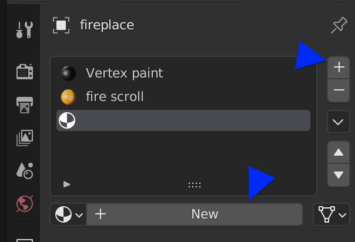
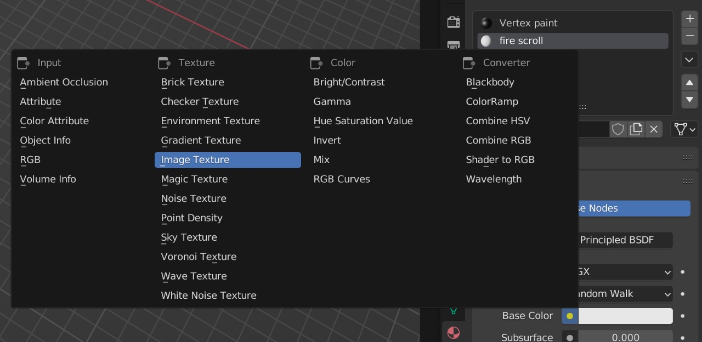
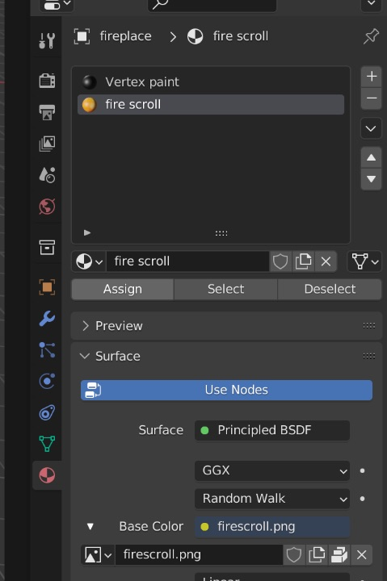

# Materials, Lights and Texture

If you haven't read the first tutorial, please do!

Ok, so there might be some questions as to how materials and other things are applied in the engine. This will try to answer all of them.

## Naming materials
The Blender add-on/exporter is sensitive to certain keywords in material names.  
These are split between flat and gouraud shaded triangles (i.e. those which have been vertex painted) and materials which use textures:

Gouraud:
- glow: This ignores any lighting calculation onto the material. Useful for example to depict light sources which do not dim at night.

Textures:
- scroll: Applies a scrolling effect like those used in the city billboards.

## Lights

Point lights can simply be placed globally in the Blender world and they will be correctly exported. All lights are currently restricted to a fixed distance/Area of effect.

## Adding a texture material

Textures are limited to 32x32 pixel in size, make sure they are that big.  
Start by adding a new material slot and material and rename according to desired option (e.g. scrolling).  

After that replace the base color with an image texture:

The final material should look like this:

Once that is done, you can simply edit the UV texture coordinates as normal. 