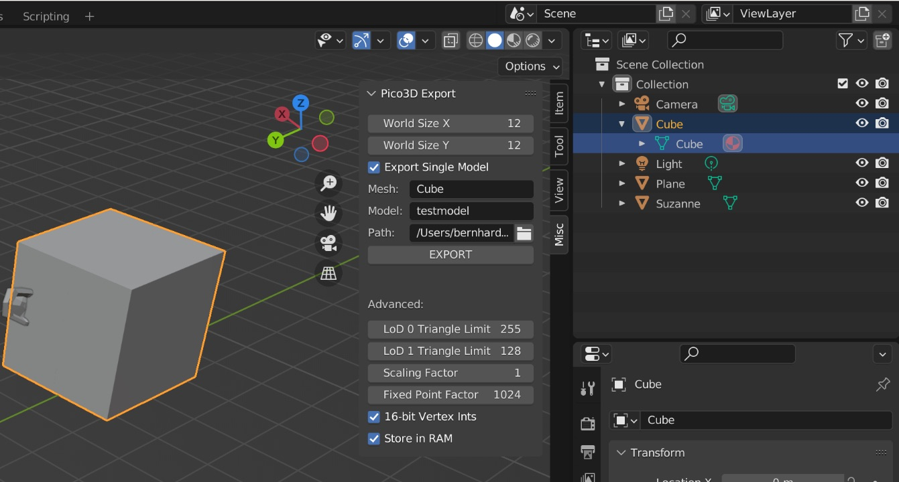

# Exporting individual meshes

While exporting chunks automatically is great for scenery, you will still need the individual object in the game world to either manipulate or have moving around.

In the prototype game of Pico3D, these separate meshes are:
- The gates of Pico City, in file logic_gate.cpp and gate.h for the mesh
- The grass as foliage, covered in logic_grass.cpp and grass.h for the mesh
- The NPCs and zombies, which mainly consists of meshes with different poses to be interpolated from. Main logic is covered by logic_npc and logic_zombies.

All of these basically feed the 3D engine with the render_triangle() function, which only needs a triangle positioned in world coordinates and you are good to go. Have a look at any of those files as a reference once you have exported your mesh.

## Exporting a single mesh from Blender
Exporting a single mesh can be done simply by putting a check box on "Export Single Model", then changing the "Mesh" name to the desired mesh and giving the resulting C array a name itself in "Model". Then choose a desired file path (testmodel.h for example) and press on EXPORT.

There are two options in Advanced that may be of interest:
- 16-bit Vertex Ints: uses less flash/ram but the model can only be 64x64 units in size (i.e. 32 units from the local object origin in each direction). This is usually sufficient unless you need a really big model (e.g. a large world backdrop).
- Store in RAM: This just adds the "const" keyword in front of the array letting the compiler know to store the mesh in flash memory. If you access the mesh frequently it may be better to keep it in RAM unless you are running low (more likely to be the case with large models).